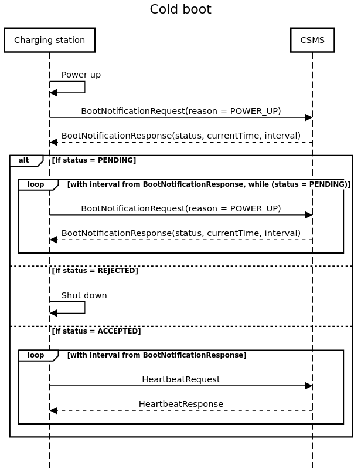

# Test_Job

Данное приложение является клиентом, развернутым на зарядной станции, с целью коммуникации с CSMS
сервером, управляющим пулом из станций.

Для коммуникации с CSMS сервером используйте интерфейс CsmsClient. Имплементировать его не нужно.
Все необходимые dto для коммуникации находятся в пакете ```com.yablochkov.ocpp2.adapter.csms.dto```

В рамках тестового задания предлагается реализовать логику Cold Boot Charging Station.
Критерием выполнения задания является прохождение теста ```ColdBootTest```, а не запуск сервиса.

Cold Boot Charging Station должен запускаться при старте приложения с помощью
класса ```StartupApplicationListener```. Логику следует реализовать в
методе ```BootService.bootUp()```.

При старте приложения отправляется BootNotificationRequest запрос в CSMS
В зависимости от статуса в BootNotificationResponse ответе реализуются следующие действия:

- ACCEPTED - клиент начинает бесконечно отправлять HeartbeatRequest и получать HeartbeatResponse
- PENDING - клиент начинает повторно отправлять BootNotificationRequest с интервалом
  BootNotificationResponse.interval до тех пор пока BootNotificationResponse.status не придет
  ACCEPTED или REJECTED
- REJECTED - приложение завершает свою работу


Cold_boot_diagrams.png

Дополнительная информация:

- Предполагается, что сервер CSMS всегда доступен и отвечает корретно.
- Можно использовать любые дополнительные библиотеки